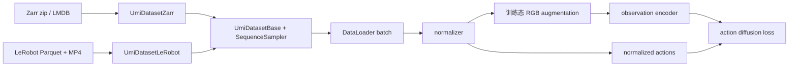

# UMI Mini

这是一个精简版的 [Universal Manipulation Interface（UMI）](https://umi-gripper.github.io/) 仓库，用于在处理完成的 UMI 数据集上训练 Diffusion Policy。原项目详情参见 [UMI 论文](https://umi-gripper.github.io/#paper)。

## 安装

本项目已在 Ubuntu 22.04 上测试。首先安装系统依赖：

```bash
sudo apt install -y libosmesa6-dev libgl1-mesa-glx libglfw3 patchelf libspnav-dev libomp-dev exiftool
```

安装 [uv](https://docs.astral.sh/uv/getting-started/installation/)，然后创建 Python 环境并安装依赖：

```bash
uv python install 3.11
uv sync
```

项目使用 CUDA 12.8 索引中的 PyTorch wheel。使用 GPU 训练时，需要安装兼容的 NVIDIA 驱动。

UMI 训练与 LeRobot 转换使用同一个根目录 `uv` 环境。该环境使用 NumPy 2、LeRobot 0.4.3
以及与其兼容的 Diffusers、Accelerate 和 Hugging Face Hub 版本。数据加载器仍直接读取标准
Parquet/MP4，避免在训练热路径中依赖 LeRobot 的 Dataset 实现。

## 将 UMI Zarr 转换为 LeRobot

默认保留绝对 world/SLAM-frame 机器人状态，并写入零值占位 action。
训练时从所选机器人的未来状态生成 action，复用 Zarr 无 action 时的处理流程。

导出 LeRobot v2.1 数据：

```bash
uv run python -m scripts.convert_umi_zarr_to_lerobot_v21 \
    /path/to/dataset.zarr.zip /path/to/umi_lerobot_v21 \
    --repo-id local/umi_state_v21 --fps 60 \
    --task "place the cup at the demonstrated target"
```

v3 使用 `scripts.convert_umi_zarr_to_lerobot_v3` 入口和独立输出目录。两个版本均将
pos + rot 合成 `observation.state.robotN_eef_tf`（每帧 4×4 齐次矩阵）。UMI
使用 YAML 配置选择 obs/action 字段和模型表示。旧 GR00T reader 需要适配 tf；
新导出不生成依赖 xyz+rotvec 列的 modality/config 文件。

转换器固定使用未来状态作为监督，不读取或导出 Zarr 中的 action，也不再提供
`--action-source` 选项。输出的零值 action 仅为 LeRobot 占位字段，加载器始终忽略该占位列。

使用 LeRobot v2.1 或 v3 数据训练 UMI：

```bash
uv run python train.py \
    --config-name=train/unet_timm_umi \
    dataset=lerobot \
    dataset.dataset_path=/path/to/umi_lerobot_v21
```

`UmiDatasetZarr` 与 `UmiDatasetLeRobot` 共同继承 `UmiDatasetBase`，复用 horizon、
latency、downsampling、SLERP 和 episode padding。采样后将绝对位姿转换为相对轨迹和
rotation-6D。完整的 GR00T 配置、统计生成步骤和 v3 限制见 [共享数据说明](docs/lerobot_gr00t.md)。

## 导出 ONNX policy

从 checkpoint 导出：

```bash
uv run python -m tool.onnx_policy.export_policy \
    /path/to/latest.ckpt \
    /path/to/policy.onnx \
    --num-inference-steps 16
```

输出只有一个 `policy.onnx`，其中包含 observation encoder、固定步数的 DDIM 去噪循环、
action 反归一化和运行所需元数据。默认优先导出 checkpoint 中的 EMA 权重；可用
`--weights model` 明确选择非 EMA 权重。`--num-inference-steps` 在导出时固化；省略时使用
checkpoint 的配置值。若要更改步数，需要重新导出。

ONNX 通常约为 checkpoint 的一半大小：训练 checkpoint 同时保存 `model` 和
`ema_model` 两套权重，而导出时只保留选中的一套推理权重。ONNX 仍使用 FP32，体积减小
不代表精度被压缩；固定步数的 `Loop` 也会复用同一套 denoiser 权重。

```python
from tool.onnx_policy import OnnxPolicy

policy = OnnxPolicy("/path/to/policy.onnx")
result = policy.predict_action(observations, seed=0)
```

## 训练

准备处理完成的 UMI Zarr 数据集，然后运行 UMI 训练配置：

```bash
uv run python train.py \
    --config-name=train/unet_timm_umi \
    dataset.dataset_path=/path/to/dataset.zarr.zip
```

使用多张 GPU 训练：

```bash
uv run accelerate launch \
    --num_processes <number-of-gpus> train.py \
    --config-name=train/unet_timm_umi \
    dataset.dataset_path=/path/to/dataset.zarr.zip
```

可以使用原项目提供的[杯子排列任务数据集](https://real.stanford.edu/umi/data/zarr_datasets/)进行训练。本仓库不包含数据采集或 SLAM 预处理脚本。

## 训练如何初始化

训练配置由 Hydra 根据顶层实验 config 和 task config 组合生成。例如：

```bash
uv run python train.py \
    --config-name=train/unet_timm_umi \
    dataset.dataset_path=/path/to/dataset.zarr.zip
```

初始化流程如下：

1. `train.py` 加载 `diffusion_policy/config/train/<config-name>.yaml`，并解析其中所有 Hydra 插值。
2. 顶层 `_target_` 指定并实例化训练 workspace。
3. Hydra 分别加载 `task`、`dataset`、`network` 和 `augmentation` config group，并合并为一个完整配置。`network` 同时选择互相兼容的 workspace、policy、optimizer 和 observation encoder。
4. workspace 实例化 `cfg.policy` 和 `cfg.dataset`，创建训练与验证 DataLoader，计算数据集 normalizer，并将其设置到 policy 中。
5. epoch 循环开始前，model、optimizer、scheduler 和 DataLoader 会交给 Hugging Face Accelerate。若 `training.use_ema: true`，还会创建一份 policy 的 EMA 副本。

四类可复用配置分别位于：

- `diffusion_policy/config/task/`：observation/action shape、horizon、latency 和 downsampling。
- `diffusion_policy/config/dataset/`：Zarr 或 LeRobot loader、数据路径、cache 和数据集切分参数。
- `diffusion_policy/config/network/`：workspace、policy、视觉 encoder、diffusion network 和 optimizer。
- `diffusion_policy/config/augmentation/`：训练时的图像增广流水线。

训练 config 只负责选择这些 group 并补充 epoch、batch size、日志和 checkpoint 设置。合并并解析后的完整配置通过 `Accelerator.init_trackers(..., config=...)` 上传到 W&B，因此一次 run 中可以同时查看 task、dataset、network 和 augmentation 设置。

两条初始化分支最终在训练环节汇合：



Zarr 与 LeRobot Dataset 都只负责读取原始图像并转换为 `[0,1]` 范围的 Tensor。训练 policy
对每个 batch 样本独立采样增强参数，并让该样本 observation history 中的所有帧共享参数。
验证和 action prediction 不执行随机增强。只有 RGB observations 会经过图像增广；低维
observations 和 actions 直接进入归一化和 Diffusion 训练。

不修改 YAML 也可以通过命令行覆盖 Hydra 配置。例如：

```bash
uv run python train.py \
    --config-name=train/unet_timm_umi \
    dataset.dataset_path=/path/to/dataset.zarr.zip \
    dataloader.batch_size=32 \
    training.num_epochs=200 \
    policy.obs_encoder.pretrained=false
```

### 选择神经网络架构

通过 `network` config group 选择 denoiser 架构。该配置会一起切换互相兼容的 workspace、policy、optimizer 和 observation encoder，而不是只修改一个模型名称。例如，可以在任意兼容的训练 config 后添加 `network=transformer_timm`。

| 架构 | Network config | Denoiser | Observation conditioning |
| --- | --- | --- | --- |
| 1-D U-Net | `network=unet_timm` | `ConditionalUnet1D` | 将 Timm 图像特征与低维 observations 展平并拼接为一个 global condition vector。 |
| Transformer | `network=transformer_timm` | `TransformerForActionDiffusion` | 将图像特征与低维 observations 投影为 `n_emb` tokens，作为 conditioning tokens 输入。 |

两种架构进行 Diffusion 的对象都是 **action trajectory**，而不是相机图像。相机 encoder 负责生成 observation condition，用于对 action trajectory 去噪。

U-Net 配置中的关键 Hydra targets 为：

```yaml
_target_: diffusion_policy.workspace.train_diffusion_unet_image_workspace.TrainDiffusionUnetImageWorkspace

policy:
  _target_: diffusion_policy.policy.diffusion_unet_timm_policy.DiffusionUnetTimmPolicy
  noise_scheduler:
    _target_: diffusers.DDIMScheduler
  obs_encoder:
    _target_: diffusion_policy.model.vision.timm_obs_encoder.TimmObsEncoder
```

Transformer 配置会替换以下三个项目 targets：

```yaml
_target_: diffusion_policy.workspace.train_diffusion_transformer_timm_workspace.TrainDiffusionTransformerTimmWorkspace

policy:
  _target_: diffusion_policy.policy.diffusion_transformer_timm_policy.DiffusionTransformerTimmPolicy
  noise_scheduler:
    _target_: diffusers.DDIMScheduler
  obs_encoder:
    _target_: diffusion_policy.model.vision.transformer_obs_encoder.TransformerObsEncoder
```

架构相关参数位于 `policy` 下。例如，U-Net 使用 `diffusion_step_embed_dim`、`down_dims`、`kernel_size` 和 `n_groups`；Transformer 使用 `n_layer`、`n_head`、`n_emb` 和 `p_drop_attn`。

视觉 backbone 由 `policy.obs_encoder.model_name` 单独选择，可以使用受支持的 Timm ViT、ResNet 或 ConvNeXt 模型。`pretrained` 控制是否加载预训练权重，`frozen` 控制是否冻结 backbone 参数。

仓库中的双臂配置使用 `task: umi_bimanual`。task config 负责定义 observation keys、shape、horizon 和最终 action dimension；policy 通过 `shape_meta: ${task.shape_meta}` 读取这些值。

### 统一位姿与 obs/action 表示

Zarr 和 LeRobot 加载后，共用内部 `robotN_eef_tf: [T,4,4]` 和
`robotN_gripper_width: [T,1]`。`tf` 表示 world-from-eef，使用列向量：
`p_world = tf @ p_eef`；位置和开口宽度单位为米，旋转向量单位为弧度。
数据中的各机器人的 world 必须是同一个参考系，才能计算跨机器人相对位姿。

`task.shape_meta` 的 obs 和 action 字段统一使用 `source`、`type`、
`relative_to`。Obs 的 key 只是模型输入名称，不再用于判断数据类型；action 的 `details`
顺序就是输出列顺序，允许不同字段使用不同表示。示例：

```yaml
obs:
  camera0_rgb:
    type: rgb3x224x224d
    horizon: 2
    latency_steps: 0
    down_sample_steps: 3
  robot0_eef_pos:
    source: robot0_eef_tf
    type: pos3d_xyz
    relative_to: robot0_eef_at_obs_end
    horizon: 2
    latency_steps: 0
    down_sample_steps: 3
  robot0_eef_rot:
    source: robot0_eef_tf
    type: rot4d_quat_wxyz
    relative_to: robot0_eef_at_obs_end
    horizon: 2
    latency_steps: 0
    down_sample_steps: 3

action:
  basic:
    horizon: 16
    latency_steps: 0
    down_sample_steps: 3
  details:
    - source: robot0_eef_tf
      type: pos3d_xyz
      relative_to: robot0_eef_at_obs_end
    - source: robot0_eef_tf
      type: rot6d_row
      relative_to: robot0_eef_at_obs_end
    - source: robot0_gripper_width
      type: width1d
```

此例的旋转 obs 为 4 维，action 为 `3+6+1=10` 维。所有 obs 的 `shape` 均从 `type` 推导；如果显式填写，会校验一致性。
`rgb3x224x224d` 表示模型图像为 `[3,224,224]`，也支持 `rgb3xHxWd` 指定其他正整数尺寸。
RGB 固定为三通道，数据集应提供对应尺寸的 HWC 图像；声明类型不会隐式缩放图像。Action 总维度自动推导。
配置不再接受旧的字符串字段列表、`robot_ids`、`source_robot_ids`、`rotation_rep`、
`representation`、`type: rgb`、`type: low_dim`、`raw_shape` 或 `down_sampling_steps`；采样步长统一拼写为 `down_sample_steps`。
旧 checkpoint 的输入名称/维度和配置也不能直接沿用。

| type | 形状 | 约定 |
|---|---:|---|
| rgb3x224x224d | [3, 224, 224] | 三通道 RGB，CHW 输出 |
| pos3d_xyz | 3 | x, y, z |
| rot4d_quat_wxyz | 4 | w, x, y, z；单位四元数 |
| rot4d_quat_xyzw | 4 | x, y, z, w；单位四元数 |
| rot6d_row | 6 | 第一行接第二行 |
| rot6d_col | 6 | 第一列接第二列 |
| rot3d_axis_angle | 3 | 旋转向量 axis × angle，弧度 |
| width1d | 1 | 夹爪开口宽度 |

四元数编码使用 canonical 符号（通常 w ≥ 0），解码会归一化；6D 解码采用正交化，
拒绝零向量/平行向量。位置和 width 使用 range normalization，所有旋转表示使用 identity。

位姿字段必须指定 `relative_to`：`world` 为绝对位姿；`robotN_eef_at_obs_end` 为指定
机器人最新观测时刻的末端坐标系；`robotN_eef_at_episode_start` 为 episode 起点。
相对变换为 `inverse(reference_tf) @ tf`，obs 和 action 共用同一参考。
Obs-end 参考位姿按 `action.reference_latency_steps` 独立采样，不依赖 obs 是否包含该机器人；
各 obs 字段的 latency/horizon/stride 可以不同。Width 不做坐标变换，可省略 `relative_to`。
`episode_start_pose_noise_scale` 控制起点参考扰动，设为 0 可用于确定性验证。

`latency_steps` 非负，以源数据帧为单位。位置/width 线性插值，旋转 SLERP，不能逐元素
插值整个 tf。采样不会越过 episode 边界；action padding 开启时重复末帧。

目前仍可读取原有磁盘字段 `robotN_eef_pos` + `robotN_eef_rot_axis_angle`，在加载边界
转换成 tf，也支持直接读取 `robotN_eef_tf`。这只是数据解码，不提供旧 YAML 配置兼容。
Zarr 与 LeRobot 均固定使用所选状态的未来轨迹作为 action 目标，不读取磁盘中的
扁平或具名 action 命令，也不需要动作来源标记。LeRobot 的 action 列仅为格式占位。

推理端可复用 `diffusion_policy.common.pose_encoding.encode_field` 和 `decode_action`。
`decode_action` 接受已反归一化的预测和相同参考 tf，返回绝对 tf/width；只预测位置或旋转时，
返回该分量，不虚构未预测的分量。批量参考 tf 需要能与轨迹维度广播，例如 `[B,1,4,4]`。
ONNX 元数据也保存 `pose_schema`，描述输入输出的表示与参考系；图内仍输出配置的表示。

## 从 Zarr 数据到 Diffusion 训练 batch

处理完成的数据集应是压缩的 Zarr store，逻辑结构如下：

```text
dataset.zarr.zip
├── data/
│   ├── camera0_rgb
│   ├── robot0_eef_pos
│   ├── robot0_eef_rot_axis_angle
│   ├── robot0_gripper_width
│   └── action                 # 可选；缺失时根据 robot state 重建
└── meta/
    └── episode_ends
```

一次训练实际读取哪些 keys，由 task config 中的 `shape_meta` 声明。低维字段通过 `source` 选择统一内部数据，RGB keys 对应磁盘字段。单个训练样本按以下步骤生成：

1. `UmiDatasetZarr` 打开 zip store，并将其复制到内存中的 Zarr store。如果设置了 `cache_dir`，则会创建或复用由文件锁保护的 LMDB cache。
2. `load_pose_data` 将存储的观测/命令分别解码成 tf 和 width；根据 `val_ratio` 和 `seed`，以 episode 为单位切分训练集和验证集。
3. `SequenceSampler` 将每个符合条件的时间索引转换为一个样本。对于每个 key，它会应用 YAML 中配置的 `horizon`、`latency_steps` 和 `down_sample_steps`。若 episode 起始位置缺少历史 observation，则使用第一个可用帧向前填充。Action sequence 从当前索引向未来截取，并可在 episode 末尾选择性填充。
4. 对带有非整数 latency 的低维信号进行插值，其中 tf 的旋转部分使用球面插值。RGB 数组在样本被请求前一直以压缩形式保留在 Zarr 中。
5. `SequenceSampler` 将 RGB 从 `T,H,W,C` uint8 转换为 `[0,1]` 范围内的 `T,C,H,W` float32。末端执行器 observations/actions 按各字段的 `relative_to` 和 `type` 转换；`UmiDatasetBase.__getitem__` 将结果转为 tensor。返回的数据结构为：

   ```text
   batch["obs"][observation_key]  # 经 DataLoader 组 batch 后为 B,T,...
   batch["action"]                # B,action_horizon,action_dim
   ```

6. 训练开始前，`get_normalizer()` 会扫描训练样本。Position 和 gripper 数据采用 range normalization，所有 rotation 表示使用 identity normalizer，图像保持在 `[0,1]`。生成的 normalizer 会保存为运行目录中的 `normalizer.pkl`，并由每个 Accelerate process 加载。
7. 在 `policy.compute_loss` 中，observations 和 actions 首先被归一化。Observation encoder 随后生成一个 global condition vector（U-Net）或一组 conditioning tokens（Transformer）。程序随机采样 diffusion timestep 和 Gaussian noise，由 scheduler 对归一化后的 action trajectory 加噪；denoiser 最终通过 MSE 学习配置的预测目标，本仓库默认配置为 `epsilon`。

### 图像增广在哪里执行

图像增广由独立的 `augmentation` config group 配置。例如 `augmentation/crop_color.yaml`：

```yaml
image_augmentor:
  _target_: diffusion_policy.model.vision.image_augmentation.BatchImageAugmentor
  image_shape: [224, 224]
  transforms:
    - type: RandomCrop
      ratio: 0.95
    - _target_: torchvision.transforms.ColorJitter
      brightness: 0.3
      contrast: 0.4
      saturation: 0.5
      hue: 0.08
```

`network` config 通过 `${augmentation.image_augmentor}` 将它注入 `policy.image_augmentor`。Hydra 会实例化标准 Torchvision transforms。自定义的 `RandomCrop` 项会由 `BatchImageAugmentor` 展开为 `RandomCrop(0.95 * image_size)`，然后 resize 回配置的图像尺寸。可在命令行使用 `augmentation=none` 关闭增广，或使用 `augmentation=crop_rotate_color` 增加随机旋转。

DataLoader batch 进入 policy 后，增强在视觉 encoder 之前执行。每个 batch 样本独立采样随机参数，同一样本的全部时间帧共享参数。增强只在 `policy.training` 为 true 的 `compute_loss()` 中运行，因此验证与 action prediction 保持确定性，也不会修改 Zarr、LeRobot 数据或 cache 中的样本。

## 许可证

本项目基于 [MIT License](LICENSE) 发布，并基于原始 [UMI 项目](https://umi-gripper.github.io/)开发。

### 选择网络观测输入

`shape_meta.obs` 只声明实际输入网络的字段。需要纯视觉输入时，注释或删除
`umi.yaml` 中的 low-dim obs；保留部分字段即可只使用这些状态。
计算相对 action 所需的末端位姿由数据集内部读取，不要求出现在 obs 中。
`action.reference_latency_steps` 独立指定参考位姿的时间偏移，单位为源数据帧，
默认 task 配置使用相机与机器人观测延迟之差；删除 obs 不会改变这个参考时刻。
