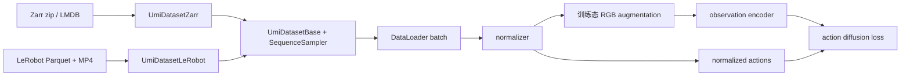

# UMI Mini

这是一个精简版的 [Universal Manipulation Interface（UMI）](https://umi-gripper.github.io/) 仓库，用于在处理完成的 UMI 数据集上训练 Diffusion Policy。原项目详情参见 [UMI 论文](https://umi-gripper.github.io/#paper)。

## 安装

本项目已在 Ubuntu 22.04 上测试。首先安装系统依赖：

```bash
sudo apt install -y libosmesa6-dev libgl1-mesa-glx libglfw3 patchelf libspnav-dev libomp-dev exiftool
```

安装 [uv](https://docs.astral.sh/uv/getting-started/installation/)，然后创建 Python 环境并安装依赖：

```bash
uv python install 3.11
uv sync
```

项目使用 CUDA 12.8 索引中的 PyTorch wheel。使用 GPU 训练时，需要安装兼容的 NVIDIA 驱动。

UMI 训练与 LeRobot 转换使用同一个根目录 `uv` 环境。该环境使用 NumPy 2、LeRobot 0.4.3
以及与其兼容的 Diffusers、Accelerate 和 Hugging Face Hub 版本。数据加载器仍直接读取标准
Parquet/MP4，避免在训练热路径中依赖 LeRobot 的 Dataset 实现。

## 将 UMI Zarr 转换为 LeRobot

默认保留绝对 world/SLAM-frame 机器人状态，并写入带来源标记的零值占位 action。
训练时从所选机器人的未来状态生成 action，复用 Zarr 无 action 时的处理流程。

当前本地 GR00T 使用 v2.1，可导出一份供 UMI 与 GR00T 共用的数据：

```bash
uv run python -m scripts.convert_umi_zarr_to_lerobot_v21 \
    /path/to/dataset.zarr.zip /path/to/umi_lerobot_v21 \
    --repo-id local/umi_state_v21 --fps 60 \
    --action-source state --task "place the cup at the demonstrated target"
```

v3 使用 `scripts.convert_umi_zarr_to_lerobot_v3` 入口和独立输出目录。
导出生成 `meta/modality.json` 和 `meta/gr00t_config.py`，让 GR00T 根据具名状态列
读取位姿/夹爪目标及统计，而不读取占位 action。原始位置、轴角字段也保留，UMI 继续
使用自己的 YAML 配置选择 obs 和 action 机器人及维度。

`--action-source stored` 保留原先的 absolute action 导出模式：如果 Zarr 已有控制命令
则保留，否则从状态拼接。默认 state 模式有意使用未来状态作为监督，不保留原 action
的命令语义。旧数据仍按原来的已存 action 路径读取。

使用 LeRobot v2.1 或 v3 数据训练 UMI：

```bash
uv run python train.py \
    --config-name=train/unet_timm_umi \
    dataset=lerobot \
    dataset.dataset_path=/path/to/umi_lerobot_v21
```

`UmiDatasetZarr` 与 `UmiDatasetLeRobot` 共同继承 `UmiDatasetBase`，复用 horizon、
latency、downsampling、SLERP 和 episode padding。采样后将绝对位姿转换为相对轨迹和
rotation-6D。完整的 GR00T 配置、统计生成步骤和 v3 限制见 [共享数据说明](docs/lerobot_gr00t.md)。

## 训练

准备处理完成的 UMI Zarr 数据集，然后运行 UMI 训练配置：

```bash
uv run python train.py \
    --config-name=train/unet_timm_umi \
    dataset.dataset_path=/path/to/dataset.zarr.zip
```

使用多张 GPU 训练：

```bash
uv run accelerate launch \
    --num_processes <number-of-gpus> train.py \
    --config-name=train/unet_timm_umi \
    dataset.dataset_path=/path/to/dataset.zarr.zip
```

可以使用原项目提供的[杯子排列任务数据集](https://real.stanford.edu/umi/data/zarr_datasets/)进行训练。本仓库不包含数据采集或 SLAM 预处理脚本。

## 训练如何初始化

训练配置由 Hydra 根据顶层实验 config 和 task config 组合生成。例如：

```bash
uv run python train.py \
    --config-name=train/unet_timm_umi \
    dataset.dataset_path=/path/to/dataset.zarr.zip
```

初始化流程如下：

1. `train.py` 加载 `diffusion_policy/config/train/<config-name>.yaml`，并解析其中所有 Hydra 插值。
2. 顶层 `_target_` 指定并实例化训练 workspace。
3. Hydra 分别加载 `task`、`dataset`、`network` 和 `augmentation` config group，并合并为一个完整配置。`network` 同时选择互相兼容的 workspace、policy、optimizer 和 observation encoder。
4. workspace 实例化 `cfg.policy` 和 `cfg.dataset`，创建训练与验证 DataLoader，计算数据集 normalizer，并将其设置到 policy 中。
5. epoch 循环开始前，model、optimizer、scheduler 和 DataLoader 会交给 Hugging Face Accelerate。若 `training.use_ema: true`，还会创建一份 policy 的 EMA 副本。

四类可复用配置分别位于：

- `diffusion_policy/config/task/`：observation/action shape、horizon、latency 和 downsampling。
- `diffusion_policy/config/dataset/`：Zarr 或 LeRobot loader、数据路径、cache 和数据集切分参数。
- `diffusion_policy/config/network/`：workspace、policy、视觉 encoder、diffusion network 和 optimizer。
- `diffusion_policy/config/augmentation/`：训练时的图像增广流水线。

训练 config 只负责选择这些 group 并补充 epoch、batch size、日志和 checkpoint 设置。合并并解析后的完整配置通过 `Accelerator.init_trackers(..., config=...)` 上传到 W&B，因此一次 run 中可以同时查看 task、dataset、network 和 augmentation 设置。

两条初始化分支最终在训练环节汇合：



Zarr 与 LeRobot Dataset 都只负责读取原始图像并转换为 `[0,1]` 范围的 Tensor。训练 policy
对每个 batch 样本独立采样增强参数，并让该样本 observation history 中的所有帧共享参数。
验证和 action prediction 不执行随机增强。只有 RGB observations 会经过图像增广；低维
observations 和 actions 直接进入归一化和 Diffusion 训练。

不修改 YAML 也可以通过命令行覆盖 Hydra 配置。例如：

```bash
uv run python train.py \
    --config-name=train/unet_timm_umi \
    dataset.dataset_path=/path/to/dataset.zarr.zip \
    dataloader.batch_size=32 \
    training.num_epochs=200 \
    policy.obs_encoder.pretrained=false
```

### 选择神经网络架构

通过 `network` config group 选择 denoiser 架构。该配置会一起切换互相兼容的 workspace、policy、optimizer 和 observation encoder，而不是只修改一个模型名称。例如，可以在任意兼容的训练 config 后添加 `network=transformer_timm`。

| 架构 | Network config | Denoiser | Observation conditioning |
| --- | --- | --- | --- |
| 1-D U-Net | `network=unet_timm` | `ConditionalUnet1D` | 将 Timm 图像特征与低维 observations 展平并拼接为一个 global condition vector。 |
| Transformer | `network=transformer_timm` | `TransformerForActionDiffusion` | 将图像特征与低维 observations 投影为 `n_emb` tokens，作为 conditioning tokens 输入。 |

两种架构进行 Diffusion 的对象都是 **action trajectory**，而不是相机图像。相机 encoder 负责生成 observation condition，用于对 action trajectory 去噪。

U-Net 配置中的关键 Hydra targets 为：

```yaml
_target_: diffusion_policy.workspace.train_diffusion_unet_image_workspace.TrainDiffusionUnetImageWorkspace

policy:
  _target_: diffusion_policy.policy.diffusion_unet_timm_policy.DiffusionUnetTimmPolicy
  noise_scheduler:
    _target_: diffusers.DDIMScheduler
  obs_encoder:
    _target_: diffusion_policy.model.vision.timm_obs_encoder.TimmObsEncoder
```

Transformer 配置会替换以下三个项目 targets：

```yaml
_target_: diffusion_policy.workspace.train_diffusion_transformer_timm_workspace.TrainDiffusionTransformerTimmWorkspace

policy:
  _target_: diffusion_policy.policy.diffusion_transformer_timm_policy.DiffusionTransformerTimmPolicy
  noise_scheduler:
    _target_: diffusers.DDIMScheduler
  obs_encoder:
    _target_: diffusion_policy.model.vision.transformer_obs_encoder.TransformerObsEncoder
```

架构相关参数位于 `policy` 下。例如，U-Net 使用 `diffusion_step_embed_dim`、`down_dims`、`kernel_size` 和 `n_groups`；Transformer 使用 `n_layer`、`n_head`、`n_emb` 和 `p_drop_attn`。

视觉 backbone 由 `policy.obs_encoder.model_name` 单独选择，可以使用受支持的 Timm ViT、ResNet 或 ConvNeXt 模型。`pretrained` 控制是否加载预训练权重，`frozen` 控制是否冻结 backbone 参数。

仓库中的双臂配置使用 `task: umi_bimanual`。task config 负责定义 observation keys、shape、horizon 和最终 action dimension；policy 通过 `shape_meta: ${task.shape_meta}` 读取这些值。

### 选择参与预测的 action 机器人

LeRobot 和 Zarr 使用相同的 `task.shape_meta.action` 配置。`robot_ids` 指定训练输出的
机器人及拼接顺序，独立于 `obs` 中的机器人。例如 obs 包含 robot0、robot1、robot2，
只预测 robot1、robot2：

```yaml
action:
  robot_ids:
    - robot1
    - robot2
  source_robot_ids: null
  shape: [20]
  # horizon、latency_steps、down_sample_steps、rotation_rep 沿用 task 配置
```

每台机器人的文件原始 action 为 7 维（position 3 + axis-angle 3 + gripper 1），
训练时转换为 10 维。加载已有 `action` 时，先按源机器人映射选择并重排 7 维块，
再进行采样、相对位姿转换和归一化。`shape` 应等于所选机器人数量乘以 10。

`source_robot_ids: null` 采用本仓库旧数据约定：**文件中全部 `robotN_eef_pos` 对应的
机器人按编号升序**，并校验原始 action 维度；该约定不依赖 YAML 的 obs 子集。
如果文件只保存部分机器人的 action，或原始块顺序不同，必须显式声明，例如：

```yaml
source_robot_ids:
  - robot2
  - robot1
robot_ids:
  - robot1
  - robot2
```

这会将原始 `[robot2, robot1]` 重排为 `[robot1, robot2]`。不要将 `source_robot_ids`
填写成期望的输出顺序，它描述的是文件实际布局；仅靠向量维度无法验证机器人身份。
不匹配的维度、重复/无效名称及缺失的所选机器人会报错。Zarr 没有 `action` 时，直接从
所选机器人的状态构造动作，此时不使用 `source_robot_ids`。旧配置省略 `robot_ids` 时，
仍默认选择 obs 中的机器人并按编号升序排列。

## 从 Zarr 数据到 Diffusion 训练 batch

处理完成的数据集应是压缩的 Zarr store，逻辑结构如下：

```text
dataset.zarr.zip
├── data/
│   ├── camera0_rgb
│   ├── robot0_eef_pos
│   ├── robot0_eef_rot_axis_angle
│   ├── robot0_gripper_width
│   └── action                 # 可选；缺失时根据 robot state 重建
└── meta/
    └── episode_ends
```

一次训练实际读取哪些 keys，由 task config 中的 `shape_meta` 声明。因此，Zarr keys 必须与 YAML 中的 keys 一致。单个训练样本按以下步骤生成：

1. `UmiDatasetZarr` 打开 zip store，并将其复制到内存中的 Zarr store。如果设置了 `cache_dir`，则会创建或复用由文件锁保护的 LMDB cache。
2. 根据 `val_ratio` 和 `seed`，以 episode 为单位切分训练集和验证集。
3. `SequenceSampler` 将每个符合条件的时间索引转换为一个样本。对于每个 key，它会应用 YAML 中配置的 `horizon`、`latency_steps` 和 `down_sample_steps`。若 episode 起始位置缺少历史 observation，则使用第一个可用帧向前填充。Action sequence 从当前索引向未来截取，并可在 episode 末尾选择性填充。
4. 对带有非整数 latency 的低维信号进行插值，其中旋转向量使用球面插值。RGB 数组在样本被请求前一直以压缩形式保留在 Zarr 中。
5. `UmiDatasetBase.__getitem__` 将 RGB 从 `T,H,W,C` uint8 转换为 `[0,1]` 范围内的 `T,C,H,W` float32。末端执行器 observations/actions 会转换为配置的 pose representation，旋转则输出为 6-D representation。返回的数据结构为：

   ```text
   batch["obs"][observation_key]  # 经 DataLoader 组 batch 后为 B,T,...
   batch["action"]                # B,action_horizon,action_dim
   ```

6. 训练开始前，`get_normalizer()` 会扫描训练样本。Position 和 gripper 数据采用 range normalization，6-D rotation 使用 identity normalizer，图像保持在 `[0,1]`。生成的 normalizer 会保存为运行目录中的 `normalizer.pkl`，并由每个 Accelerate process 加载。
7. 在 `policy.compute_loss` 中，observations 和 actions 首先被归一化。Observation encoder 随后生成一个 global condition vector（U-Net）或一组 conditioning tokens（Transformer）。程序随机采样 diffusion timestep 和 Gaussian noise，由 scheduler 对归一化后的 action trajectory 加噪；denoiser 最终通过 MSE 学习配置的预测目标，本仓库默认配置为 `epsilon`。

### 图像增广在哪里执行

图像增广由独立的 `augmentation` config group 配置。例如 `augmentation/crop_color.yaml`：

```yaml
image_augmentor:
  _target_: diffusion_policy.model.vision.image_augmentation.BatchImageAugmentor
  image_shape: [224, 224]
  transforms:
    - type: RandomCrop
      ratio: 0.95
    - _target_: torchvision.transforms.ColorJitter
      brightness: 0.3
      contrast: 0.4
      saturation: 0.5
      hue: 0.08
```

`network` config 通过 `${augmentation.image_augmentor}` 将它注入 `policy.image_augmentor`。Hydra 会实例化标准 Torchvision transforms。自定义的 `RandomCrop` 项会由 `BatchImageAugmentor` 展开为 `RandomCrop(0.95 * image_size)`，然后 resize 回配置的图像尺寸。可在命令行使用 `augmentation=none` 关闭增广，或使用 `augmentation=crop_rotate_color` 增加随机旋转。

DataLoader batch 进入 policy 后，增强在视觉 encoder 之前执行。每个 batch 样本独立采样随机参数，同一样本的全部时间帧共享参数。增强只在 `policy.training` 为 true 的 `compute_loss()` 中运行，因此验证与 action prediction 保持确定性，也不会修改 Zarr、LeRobot 数据或 cache 中的样本。

## 许可证

本项目基于 [MIT License](LICENSE) 发布，并基于原始 [UMI 项目](https://umi-gripper.github.io/)开发。
